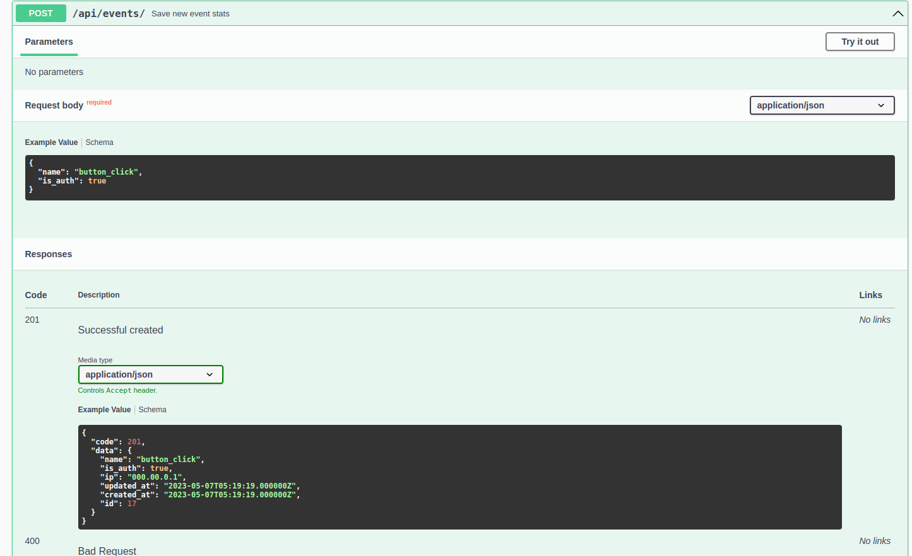
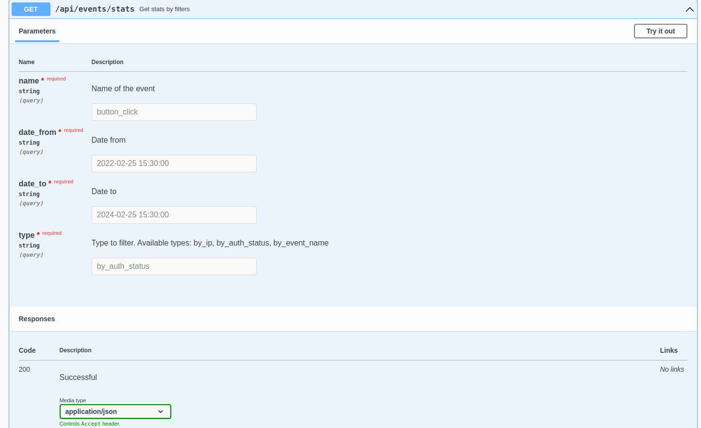

## Набор API-методов для сохранения событий и получения статистики.

## Разворот

1. `git clone https://github.com/ilyazenQ/stats.git` 
2. `cd stats` 
3. `composer require laravel/sail --dev` 
4. `./vendor/bin/sail up` 
5. `cp .env.example .env` В .env.example указаны верные данные для cтандартного sail контейнера 
6. `./vendor/bin/sail shell` 
7. `php artisan key:generate` 
8. `php artisan storage:link` 
9. `php artisan jwt:secret` 
10. `php artisan l5-swagger:generate` 

## Документация и методы
Документация: http://localhost/api/documentation#/  
Создание события:
  
Получение агрегированных событий: 
  

